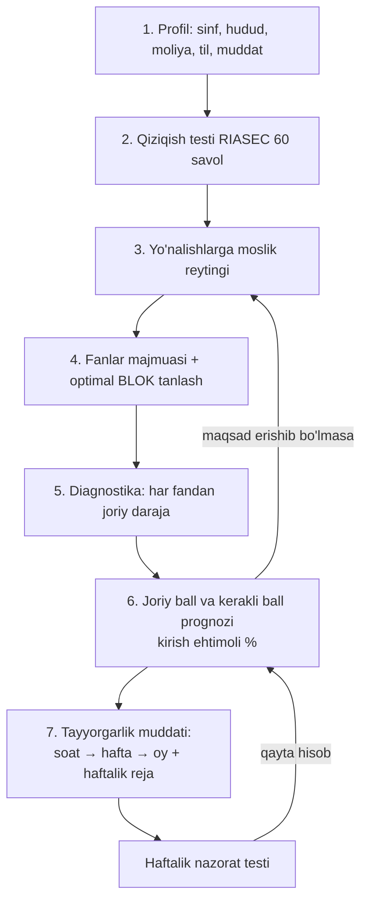

# Kompas — abituriyent uchun yo'nalish va tayyorgarlik navigatori

> **Maqsad:** o'quvchi qiziqishlarini kiritadi → tizim unga mos O'zbekiston OTMlari va
> ta'lim yo'nalishlarini topadi → o'sha yo'nalishga qaysi fanlardan imtihon topshirilishini
> aniqlaydi → o'sha fanlardan **qancha muddat tayyorlansa kira olishini** hisoblab beradi.

Ushbu papkada mahsulotning **ishlaydigan veb-ilovasi** (Faza 1 — MVP) va uning
**tahlili, algoritmi, ishlar ketma-ketligi** joylashgan.

## Ilova

GitHub Pages: `https://<foydalanuvchi>.github.io/OscarTalim/kompas/` · Lokal: `index.html` ni
brauzerda oching (build kerak emas, `file://` da ham ishlaydi) yoki `npx http-server docs/kompas`.

| Qism | Fayl | Nima qiladi |
|---|---|---|
| Sozlamalar | `js/config.js` | Ball koeffitsientlari, kalendar, minimal ball, model parametrlari — **kod emas, konfiguratsiya** |
| Yadro | `js/engine.js` | Sof funksiyalar: RIASEC, moslik, blok optimizatsiyasi, ball modeli, ehtimollik, Monte-Carlo, tayyorgarlik rejasi |
| Ilova | `js/app.js` | 7 ekran: Bosh → Profil → Test → Natija → Fanlar → Daraja → Reja (+ Manba) |
| Dizayn | `css/kompas.css` | Token tizimi, yorug'/qorong'i mavzu, mobil |
| Ma'lumot | `data/` | Yo'nalishlar (4 fayl), mavzu daraxtlari (12 fan), RIASEC savollari, OTM va fanlar lug'ati — sxema: `data/SCHEMA.md` |
| Tekshiruv | `scripts/validate.js`, `scripts/test_engine.js` | `node docs/kompas/scripts/validate.js` — ma'lumot; `node docs/kompas/scripts/test_engine.js` — yadro |
| PWA | `manifest.webmanifest`, `sw.js`, `icon.svg` | Telefonga o'rnatiladi, offline ishlaydi |

Foydalanuvchi holati faqat brauzerning `localStorage` ida saqlanadi — server, hisob, shaxsiy
ma'lumot yig'ish yo'q.

## Hujjatlar

| Fayl | Nima haqida |
|---|---|
| [ALGORITM.md](ALGORITM.md) | Asosiy hujjat: tizim modullari, 7 qadamli algoritm, barcha formulalar, namunaviy hisob-kitob |
| [MAALUMOT-MODELI.md](MAALUMOT-MODELI.md) | Ma'lumotlar bazasi sxemasi, ETL (ma'lumot yig'ish) quvuri, validatsiya qoidalari |
| [YOL-XARITA.md](YOL-XARITA.md) | Fazalar, sprintlar, 2027-yil qabul kalendariga bog'langan reja, metrikalar |
| [MANBALAR.md](MANBALAR.md) | Barcha manbalar, tasdiqlangan faktlar va **tekshirilishi shart** bo'lgan ochiq savollar |

## Bir qarashda: asosiy oqim

## Mahsulotning asosiy g'oyasi (nega bu ishlaydi)

O'zbekistonda 2024-yildan beri qabul **«avval test — so'ng tanlov»** tamoyilida ishlaydi:
abituriyent avval fanlar blokini tanlab test topshiradi, ballini biladi, keyin **5 tagacha**
(OTM + yo'nalish) ni ustuvorlik tartibida tanlaydi.

Shundan kelib chiqib mahsulot **ikkita eng og'riqli qarorni** yechadi:

1. **Fevral–iyun:** «Qaysi blokdan test topshiray?» — bu qaror keyin ochiladigan yo'nalishlar
   ro'yxatini butunlay belgilab qo'yadi, lekin ko'pchilik uni tasodifiy tanlaydi.
2. **Iyul–avgust:** «5 ta tanlovni qanday tartibda qo'yay?» — bu yerda har yili minglab
   abituriyent yuqori ball bilan ham noto'g'ri strategiya sababli o'qishga kirmay qoladi.

Bu ikkalasi ham **hisoblanadigan optimizatsiya masalasi** — biz aynan shuni avtomatlashtiramiz.

## Muhim eslatma

Tizim **rasmiy manba emas**. Har bir tavsiya yonida ma'lumot manbai va yangilangan sanasi
ko'rsatiladi, yakuniy qaror uchun `uzbmb.uz` va `my.uzbmb.uz` ga murojaat qilish talab etiladi.
Hech qachon «kirasiz» deb kafolat berilmaydi — faqat **ehtimollik** ko'rsatiladi.
